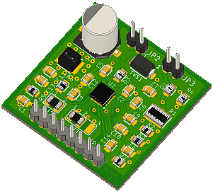

# STKNX Breakout Board
Es handelt sich hierbei um den noch ***ungetesteten*** Entwurf eines Breakout Boards für das KNX TP1-256 Frontend [STKNX](https://www.st.com/en/interfaces-and-transceivers/stknx.html) der Firma STMicroelectronics im etwas unhandlichen QFN Gehäuse.

Der STKNX trennt die Versorgungsspannung von den auf dem KNX-Bus übertragenen Daten, welche er als Bitstrom ausgibt. Er enthält keinen eigenen Controller, dafür aber einen von 1 - 12V einstellbaren Step-Down-Konverter sowie einen auf 3.3V bzw. 5V einstellbaren Linearregulator.
