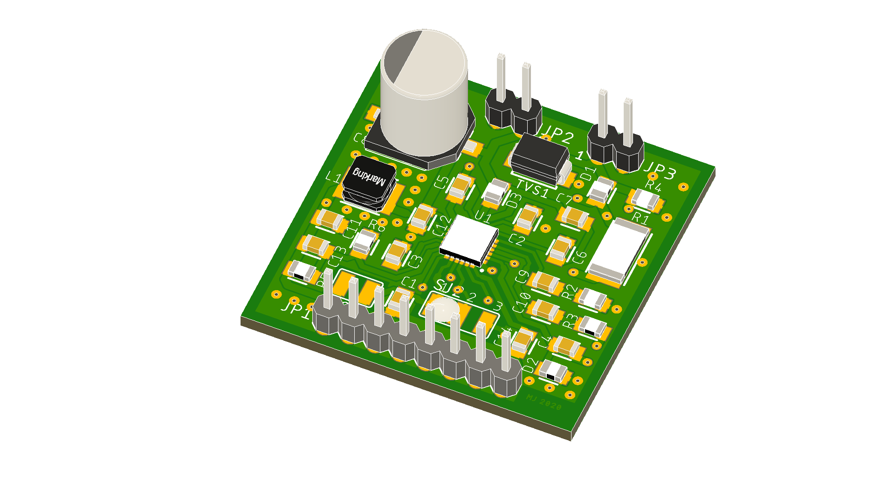
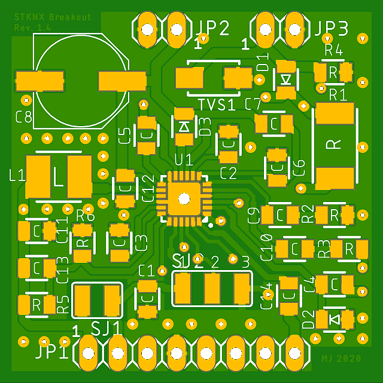

# STKNX Breakout Board
Es handelt sich hierbei um den noch ***ungetesteten*** Entwurf eines Breakout Boards für das KNX TP1-256 Frontend [STKNX](https://www.st.com/en/interfaces-and-transceivers/stknx.html) der Firma STMicroelectronics im etwas unhandlichen QFN Gehäuse.

Der STKNX trennt die Versorgungsspannung von den auf dem KNX-Bus übertragenen Daten, welche er als Bitstrom ausgibt. Er enthält keinen eigenen Controller, dafür aber einen von 1 - 12V einstellbaren Step-Down-Konverter (max. 150mA) sowie einen auf 3.3V bzw. 5V einstellbaren Linearregulator (max. 20mA).

**Achtung: Der Jumper SJ2 darf nur überbrückt werden (Linearregler aus), wenn Vout nicht größer als 5V ist!!**

## V1.3 - Initiale Version

[Schaltplan](docs/stknx_breakout_sch.pdf) \
[Eagle-Dateien](eagle)

## V1.4
- R1 geändert auf SMD 2512
- einige Bauteile neu platziert
- Hinweis zu Jumper SJ2 eingefügt (nur überbrücken, wenn Vout <= 5V)
- Schaltplan: Hinweis für Spannungsfestigkeit C11 

[Schaltplan](docs/stknx_breakout_sch_v14.pdf) \
[Eagle-Dateien](eagle)

